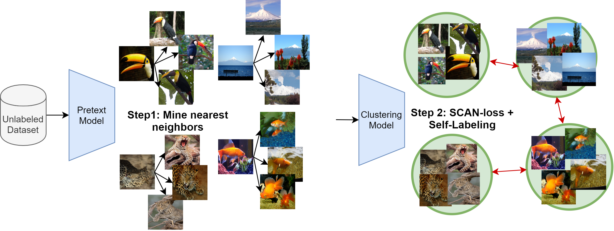
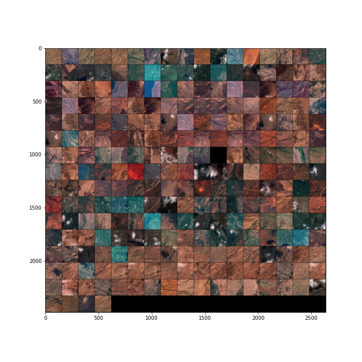

# This notebook is ment to be a quick start quide. It includes tutorials to get started with `SCAN` model.


## SCAN  : Semantic Clustering by Adopting Nearest Neighbors

SCAN is an unsupervised approach which claims to achieve state of the art performance in image classification without using labels. The algorithm is divided into three stages lets discuss what each does in brief. 

The 3 parts which make up the algorithm are

1. pretext : The Idea of pretext task comes from Representational learning where feature representation is learned solely from the images. This is done my `minimizing the distance between a image and its augmentation`. Since the neural net used has a `limited capacity it tries to remember only the important characteristics which help classify that image.`

2. SCAN : This models learns on the weights of the pretext models and outputs a probablilty distributions for C classes where C in our case is the no. of clusters. Hence the output of this stage is similiar to that of a mutli-class classifier.

3. Selflabel : This is a fine tuning step. The model used for selflabel and scan are same. 

Read <a hre = "https://clivefernandes777.medium.com/scan-lets-classify-images-without-labels-e31388da9cfd">my blogs </a> for more details 


Below Image depicts working of the model on the cifar-10 dataset.





The following <a href ='https://www.youtube.com/watch?v=hQEnzdLkPj4&feature=youtu.be' >youtube video</a> can is a good place if you want to understand the inner working of the mode. 


Link to the paper: https://arxiv.org/abs/2005.12320


Link to the original Repo : https://github.com/wvangansbeke/Unsupervised-Classification


# Important Folders and functions


```python
!ls -d */
```

    configs/
    data/
    images/
    LandCover/
    losses/
    models/
    scan_no_validation/
    tutorial/
    utils/
    Weights/
    

1. `scan_no_validation` : SCAN repo. with validation code removed. In practical we wont have labels if we are using unsupervised approach
2. `configs` : The configs folder contains 3 folders pretext,scan,selflabel one per phase. In this folder config files for cifar_10,eurosat and keyna_153x153 are included. 

3. `data` : This folder holds the data pipelines. 

4. `losses` : losse functions for each model. 

5. `models` : model defination. we are using the resnet-18 model  as the base model for all 3 parts. 


```python
!ls -f ^s*.py
```

    scan.py
    selflabel.py
    setup.py
    simclr.py
    

1. simclr.py : This file is used to train the pretext model.It accepts 2 command line params. The env to work in and the config.yml file. 
eg.

`!python pretext.py --config_env configs/env.yml --config_exp configs/pretext/simclr_kenya_custom_augmentation.yml`

2. scan.py : This file is used to train the scan model. Inputs same as pretext but the config file is different. 
3. selflabel.py : This files trains the self-label model (fine tunes  the scan model)


# Tutorials

## Copy the notebooks into the root folder otherwise there will be import error

This folder contains 2 jupyter notebooks one  trained  on `cifar_10` dataset and the other to train on  `euroSat` dataset. 


```python
!ls tutorial/
```

    SCAN Eurosat.ipynb
    SCAN_cifar10 _85.ipynb
    

## Cifar10
       The Model was trained on the cifar10 dataset to check the claims of the authors. Run the **SCAN_cifar10_85** notebook to train on the cifar10 dataset. We dont need to download the dataset the there are scripts to take care of it.
       
## Eurosat 
       This dataset was quite similar to the our usecase  with 10 classes and would act as a fact check. The data needs to be downloaded. The final model accuracy is 92% on  which quite good.
   

# Some Results on euroSat


The two plots on top represent the image representation of eurosat dataset plotted in 2d using PCA. Each color represents different classes can view the legend for more details. The plot of the left Side Represents the True labels and the one on the right are the predictions using the scan algorithm. As one can see the two images are nearly identical the model gets a 92% accuracy.

# Evaluating : Model Weights

Model weights are saved in the Weights/euroSAT folder. We have 3 models (pretext,scan,selflabel) but for validation we only require one scan or selflabel.

## `Training Hack` 

To train the model from a scratch a quick way or hack is to train the pretext model for some epochs (this is done as the weights are needed to start training scan model). The main part is the topk-train-neighbours located in the Weights/euroSAT/pretext/. This serve as the labels for the scan model. Since I have already trained the pretext model if all the configs are kept intact the scan model should produce similar results.


# Training on Kenya Images 


## DataSet Description 
The dataset consists of 259 sentinel 2 10m resolution tif images.The image size is 153 x 153, to train the scan model RGB channels were extracted from the tiff images and the images were saved in .jpeg format.

`REMARK` : At the end when mapping the clusters to the map. The tiff images were required as they contain the bounds (lat,lan). Instead of that saving the lat,lan of each image during the jepg conversion will be a better approach.


# Results: 

1. The model has been trained for clusters C = 5,6,8. The aim of this clustering step was to get the Pseudo Labels. 
2. Since we didnt have labels here the original scan repo had to be modified to remove all the valdiation part. The   modified repo is saved in the folder `scan_with_no_validation`.
3. The Results are stored in the Kenya_Cluster_Images folder they contain the cluster images, .csv files containing the lat,lan per cluster.
4. The notebooks are stored in the Kenya NoteBooks Folder. lets see more abt. them.
5. To train run the notebooks move them to the scan_with_no_validation
6. All the config files are present there in the configs folder.


```python
!ls 'Kenya Notebooks'
```

    Kenya_map_plots.ipynb
    SCAN_(Kenya)_5_Clusters.ipynb
    SCAN_(Kenya)_6_Clusters.ipynb
    SCAN_(Kenya)_8_Clusters.ipynb
    SCAN_DataPipeline_Augmentation_keep.ipynb
    

Since they model has been trained for cluster C = (5,6,8) we have one notebook for each. A few things to note down here are
for cluster C = (5,8) the parametres for the config files are similar to the original scan repo. only chnaging the img_size = 153. 


For Cluster C = 6. Different augmentations were tried results can be found in the `SCAN_DataPipeline_Augmentation_keep` notebook. Now lets look at the cluster results. 

# Kenya Dataset Contininig 259 images 




# Results

## Cluster images for C = 5


# Cluster 6 (custom augmentation)  [Selected Model]


# Cluster 8


## All the images are saved in the `Kenya_Cluster_Images` folder

## 2D Scatter Plots

The following plot was obtained by first using PCA to get the (x,y) cordinates for each image. Then the images and the assigned cluster labels are plotted on the coordinates.


Final Results: Custom Augmentations are saved in the Kenya_Cluster_Images/final_output_6
    
    
    

# Training a Custom SCAN Model.

Things to consider.


1. config fles 
2. creating a dataset class 
3. modifying the common_config.py file. 


## 1. Config Files 

Each stage (pretext,scan,self-label) have seperate files saved in the config folder. Here are some fields to consider when training on custom dataset.


The config files can be divided into 3 sections 

1. Augmentations 
2. Optimizers 
3. Model and Dataset info


## Model and dataset info.

```yml 

# Setup
setup: simclr

train_dir: KenyaModel_5CLS

# Model
backbone: resnet18
model_kwargs:
   head: mlp
   features_dim: 128

# Dataset
train_db_name: KenyaDataset
num_classes: 5

```

Consider the above file this is just a part of the config file. Lets understand what is means. 


1. `step` : This key represents the model being trained simclr is the approach used to train pretext model for the scan and self-label this will be replaced with their respective names. 

2. `train_dir` : path to the output folder. If the folder doesn't exist it will be created. Within the folder the pretext,scan,self-label will be stored. 

3. `backbone` : Model architecture to use. 

4. `feature_dim` : output size of the pretext model. 

5. `train_db_name` : name of the dataset class


## Optimizers: 

1. For the pretext model : Use only SDG algorithm as used in the original repo.
2. For scan and self-label : Same optimizer is used for both for smaller images adam is used but for larger image size SGD works better. 
        


## Augmenataions 

For smaller images of size 32 or 64 scan and self-label model use augmentations proposed by the authors.
```yml 
# Transformations
augmentation_strategy: ours 
augmentation_kwargs:
   crop_size: 32
   normalize:
      mean: [0.4914, 0.4822, 0.4465]
      std: [0.2023, 0.1994, 0.2010]
   num_strong_augs: 4
   cutout_kwargs:
     n_holes: 1
     length: 16
     random: True

transformation_kwargs:
   crop_size: 32
   normalize:
      mean: [0.4914, 0.4822, 0.4465]
      std: [0.2023, 0.1994, 0.2010]

```

1. augmentation_strategy : This key specifies which strategy is being used, followed by the args. On top the training augmentations are set and at bottom validation arguments. While the model is in inferene the validation args are used. These remain unchnaged for all 3 models. 


If using the default config the param to change is the `crop_size` set it to ur image size for kenya 153 


**It is also notice that for larger image size eg (224 x 224) the authors have resulted in using same augmentation as the pretext for all 3 stages.**

```yml

# Transformations
augmentation_strategy: simclr 
augmentation_kwargs:
   random_resized_crop:
      size: 153
      scale: [0.2, 1.0]
   color_jitter_random_apply:
      p: 0.8
   color_jitter:
      brightness: 0.4
      contrast: 0.4
      saturation: 0.4
      hue: 0.1
   random_grayscale: 
      p: 0.2
   normalize:
      mean: [0.4914, 0.4822, 0.4465]
      std: [0.2023, 0.1994, 0.2010]

transformation_kwargs:
   crop_size: 153
   normalize:
      mean: [0.4914, 0.4822, 0.4465]
      std: [0.2023, 0.1994, 0.2010]


```

These were the final custom augmentations used for training the final model. 

```yml
augmentation_strategy: custom_aug
augmentation_kwargs:
   random_resized_crop:
      size: 153
      scale: [0.5, 1.0]
      ratio: [0.75,1.3333]
   color_jitter_random_apply:
      p: 0.8
   color_jitter:
      brightness: [0.5,2]
      contrast: [2,7]
      saturation: 0
      hue: 0
   normalize:
      mean: [0.4049, 0.3090, 0.2831]
      std: [0.2702, 0.1792, 0.1679]

transformation_kwargs:
   crop_size: 153
   normalize:
      mean: [0.4049, 0.3090, 0.2831]
      std: [0.2702, 0.1792, 0.1679]

```


## Modifying the common_config.py file

 This file is responsiable for loading the dataset,model,train/val augmentations etc. And modifications made in the config files need to me made in this file.


## PreTrained Model Weights 


Model weights for cluster = 6 are store in the Weights/Kenya_6CLS_153


```python
!ls Weights/KenyaModel_6CLS_153/
```

    pretext
    scan
    selflabel
    

## Conclusion:

The sacn model does a ok job at clustering differnt classes. A few  things to note here are. 

1. The data distribution is skewed. There were only 3 images for containing water, most of them belonged to shrubland.
2. Some images contain multiple classes and makes it difficult fot the model to assign proper clusters. 
3. Cloudy Images : With cluster = 8 does the best job at clustering the cloudy images followed by 5. 
